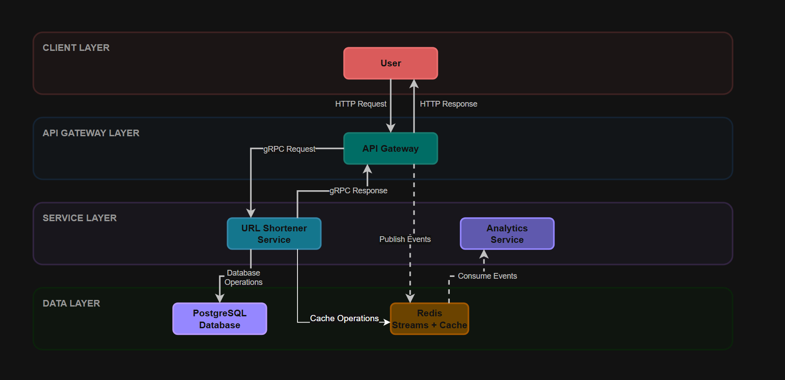

# URL Shortener - Distributed Microservices Platform

A Go-based microservices URL shortener.

## Overview

A production-simulated microservices platform written in Go, containerized with Docker, deployed to Kubernetes, and tested via CI/CD. Includes REST/gRPC interfaces, asynchronous event logging, and observability hooks.

## Project Structure
```
url-shortener/
├── cmd/                         # Entry points for services and clients
│   ├── gateway-service/         # REST API → gRPC gateway
│   ├── url-service/             # Core URL logic and persistence
│   ├── analytics-service/       # Asynchronous event consumer
│   └── test-client/             # Manual and integration test clients
├── dashboards/
│   └── url-shortener-dashboard.json # Dashboard for Grafana
├── proto/                       # gRPC protobufs
├── internal/                    # Core application code
│   ├── analytics/               # Analytics logic and tests
│   ├── database/                # Database connection & handling
│   ├── events/                  # Event definitions and handling
│   ├── gateway/                 # Gateway handlers and tests
│   ├── models/                  # Data models
│   ├── queue/                   # Queue interface and Redis streams
│   ├── repository/              # Data repositories (including Postgres)
│   └── service/                 # URL Service logic and tests
├── url-shortener/               # Helm Charts
├── .github/workflows/           # GitHub Actions CI/CD config
├── docker-compose.yml           # Local container orchestration
└── README.md                    # Project overview
```

## Tech Stack:
- Language: Go
- Protocol: REST, gRPC
- Data & Messaging: PostgreSQL, Redis Streams
- Infra & Platform: Docker, Kubernetes, GitHub Actions
- Testing: Unit tests, integration test clients, CI coverage

## Architecture

### Component Breakdown:
- **gateway-service**: Accepts REST requests and forwards them via gRPC to internal services.
- **url-service**: Core logic service that generates shortcodes and persists mappings to PostgreSQL.
- **analytics-service**: Subscribes to Redis Streams to consume and log access events asynchronously.
- **Redis**: Acts as the message broker using Redis Streams for event delivery.
- **PostgreSQL**: Stores URL mappings and access statistics.



### Data Flow:
- HTTP REST request -> Gateway -> gRPC -> url-service
- gateway-service publishes access events to Redis Stream → analytics-service consumes and logs them

## Intent 
- Build realistic backend infra with decoupled components
- Apply containerization, orchestration, and CI/CD principles
- Practice patterns like event-driven design and infra-as-code
- Simulate scalable deployment with K8s and Prometheus-ready endpoints

## Running the Project

### Local: Docker Compose

#### Prerequisites

1. [Docker](https://docs.docker.com/get-docker/) 

2. [Docker Compose](https://docs.docker.com/compose/install/) (may be included with docker)

#### Run Services

To run all of the services you can use the following docker compose command.

```
docker compose up -d --build
```

### Local: Kubernetes: Minikube

#### Prerequisites

[Minikube](https://minikube.sigs.k8s.io)

[kubectl](https://kubernetes.io/docs/tasks/tools/)

[Helm](https://helm.sh/docs/intro/install/)

#### Run Services

The following commands will run all of the services and open the port to your local machine for testing.
You will need to port forward url-service to directly test gRPC endpoints. (Done in test clients)

Local helm charts are found under ./url-shortener
```
minikube start

# build images
eval $(minikube docker-env)
docker build -t analytics-service:latest -f ./cmd/analytics-service/Dockerfile .
docker build -t gateway-service:latest -f ./cmd/gateway-service/Dockerfile .
docker build -t url-service:latest -f ./cmd/url-service/Dockerfile .

# Install helm release using local chart, render k8s manifests and apply to cluster
helm install dev-url-shortener url-shortener/

# wait for all services to ready
# check for availability through
kubectl get pods

# you may need to port forward to test 
kubectl port-forward svc/dev-url-shortener-gateway-service 8080:8080
```

### Observability: Prometheus and Grafana

This project currently exposes the /metrics endpoints to all services on port 2112. 
There is a service monitor setup to find all matching services and endpoints.

#### Prerequisites:

To run the observability stack, Prometheus and Grafana will need to be installed. This is most easily done through Helm using the kube-prometheus-stack. Ensure your kubernetes is online.

Instructions can be found here.
[kube-prometheus-stack](https://github.com/prometheus-community/helm-charts/tree/main/charts/kube-prometheus-stack)

#### Open dashboards:

There is a preconfigured dashboard that can be found under /dashboards/url-shortener-dashboard.json

These commands will download and install the prometheus stack for minikube through helm. It also forwards the port so the dashboard is accessible from your local machine. From there your kubernetes cluster will have the whole stack available including prometheus UI and grafana dashboards.
```
helm repo add prometheus-community https://prometheus-community.github.io/helm-charts
helm repo update
helm install prometheus prometheus-community/kube-prometheus-stack
kubectl port-forward svc/prometheus-grafana 3000:80
```

From here you can open up the dashboard at localhost:3000.

Default credentials for Grafana
Username: admin
Password: prom-operator


### Clean Up

```
# To remove helm releases:
helm uninstall dev-url-shortener
helm uninstall prometheus
```
## Testing

### Integration Test Clients

Run after services are up. Confirm with `docker ps`, or `kubectl get pods`

To run all integration tests.
```
./testingscripts/run-test-clients.sh
```
To run the test client run this command

`
go run cmd/test-client/main.go
`

To run unit tests with coverage 

`
go test ./... -coverprofile=coverage.out
`

To see an HTML report

`
go tool cover -html=coverage.out -o coverage.html
`

### Load Testing

This will generate synthetic traffic via HTTP to your running gateway endpoint (default: localhost:8080).
Ensure the service is running and port-forwarded before executing.

```
k6 run --vus [**number of virtual users**] --duration [**time**] testingscripts/loadtest.js
```

## Endpoints:

Defined in proto/url_service.proto

    rpc CreateShortURL(CreateURLRequest) returns (CreateURLResponse);
    
    rpc GetOriginalURL(GetURLRequest) returns (GetURLResponse);
    
    rpc HealthCheck(HealthRequest) returns (HealthResponse);

Example usage with grpcurl:
```
grpcurl -plaintext -d '{"original_url":"https://example.com","user_id":"user123"}' localhost:50051 urlservice.URLService.CreateShortURL
```


## Roadmap 

### Completed 
- Core shortening logic (in-memory → Postgres + Redis Cache)

- Microservice decomposition

- gRPC + REST translation via gateway

- Redis Streams → analytics event processing

- CI/CD pipeline + integration testing

- Kubernetes deployment manifests

- Structured logging

- Prometheus metrics exposure

- Observability dashboards (Grafana)

- K6 Load testing

### In Progress

- Blog Post 

- Fix CD to have staging name space for integration testing before deployment to default


## Appendix
| Method | Path           | Description              |
| ------ | -------------- | ------------------------ |
| POST   | `/create`      | Create shortened URL     |
| GET    | `/{shortcode}` | Redirect to original URL |
| GET    | `/healthz`     | Service health check     |

Example usage:

```
curl -X POST -H "Content-Type: application/json" -d '{"url": "https://example.com"}' http://localhost:8080/create
```

hello test